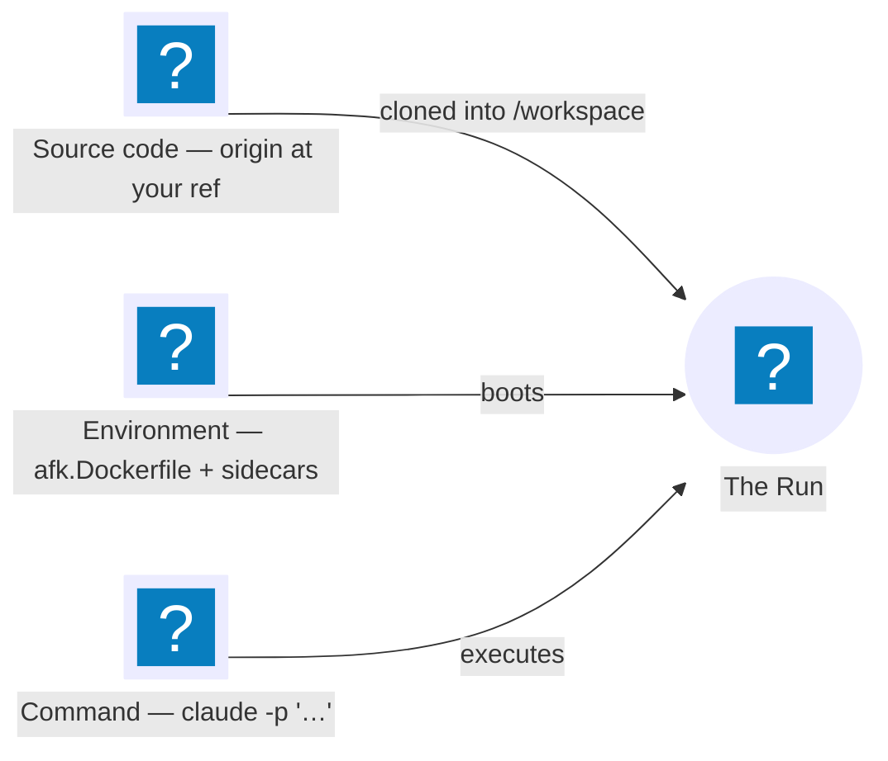

Every Backend follows the same shape: `afk run` launches a compute primitive in
your cloud, clones your repo at your current branch, and runs the command you
gave it. In steps, the CLI:

1. **Refuses** if the working tree is dirty or the ref isn't pushed to origin.
2. **Builds** your `afk.Dockerfile` into an agent image, wrapped with a
   CLI-owned entrypoint (skipped if the `<branch>-<sha>` image already exists).
3. **Launches one compute primitive** for the Run — an EC2 VM on AWS, a Compute
   Engine VM on GCP, a Container instance on Cloudflare, a local `dind`
   container on Local — booted from the project's [Golden
   Image](/afk/concepts/glossary/#golden-image).
4. That primitive **clones your repo** at the ref into `/workspace`, then runs
   your command — under `docker compose up` if you have an `afk.compose.yml`,
   else `docker run` — inside a wall-clock timeout, shipping each service's
   logs.
5. On exit the primitive is **reclaimed** — or, on a Run launched with
   `--retain` (AWS/GCP), stopped and held for post-mortem `afk attach` until the
   [retention period](/afk/concepts/glossary/#retention) elapses. The CLI does not
   stay resident; the Run lives on the primitive, so a dead laptop doesn't
   affect it.

The per-Backend specifics — how the primitive is launched, provisioned,
attached to, and torn down — live in the [Backend docs](/afk/backends/overview/).

## What a Run is made of

Three parts, supplied separately:

- **The source code** — cloned fresh at every Run start, at the ref you choose
  (default: your current branch), into `/workspace`.
- **The environment** — the Docker image your command runs in, built from
  `afk.Dockerfile` (toolchain and dependencies, **not** the source), plus any
  sidecar services (Postgres, Redis, …) declared in `afk.compose.yml`.
- **The command** — any shell command; the most obvious one being
  `claude -p "fix the failing test and open a PR"`.

### Why the source is cloned, not baked into the image

- Image rebuilds only when dependencies change (rare).
- Code changes (constant) don't trigger a rebuild — `afk run` stays fast.
- The image at a given tag is reproducible from the `afk.Dockerfile` alone.

This is also why step 1 refuses to launch unless the working tree is clean and
the ref is pushed to origin: it buys the invariant that **what runs in the
cloud is exactly what's on origin** — no auto-push, no dirty-tag, no surprise
branches. The same guards make `afk.Dockerfile` and `afk.compose.yml`
trustworthy: both are read from the local working tree, and clean-tree +
pushed-ref guarantee they match origin's content at the ref.
