**AFK** is a CLI to run AI development workloads inside your own cloud
environment.

We were among the first users of Claude Code, and our developers steadily moved
from AI on their laptops toward workflows where the agent runs on a server.
Claude Code ships native cloud environments — but they aren't configurable and
don't live in your own infrastructure. We wanted our **entire dev environment**
in the cloud, so the AI can run the tests, the database, the whole stack — and
we didn't want to manage persistent cloud dev environments (GitHub Codespaces
and friends) to get there.

The result is AFK: a CLI that runs **ephemeral AI sessions in a configurable
cloud environment you own**. Built for AI agents that work while you're AFK
("away from keyboard") — but any command-runnable workload fits.

The core unit is a **Run**: one ephemeral execution of a developer-defined
command inside a container in the cloud. A Run starts when its entrypoint command
begins and ends when that command exits. While it's alive you can optionally
attach to observe or intervene — but attach isn't required for a Run to be
useful.

## The one idea

The CLI surface is **identical across Backends**. `afk run`, `afk attach`,
`afk ls`, and `afk kill` mean the same thing whether the work lands on:

- an **EC2 instance** on AWS,
- a **Compute Engine VM** on GCP,
- a **Cloudflare Container instance**, or
- a **Docker container** on your own machine (Local).

Each Run executes on a short-lived **compute primitive** that you own end to
end. You configure it with the native dev tools you already use: a Dockerfile
describes the environment your command runs in, and an optional compose file
attaches sidecar services (Postgres, Redis, …).

```mermaid
architecture-beta
  service cli(lucide:terminal)[afk run]

  group vm(lucide:cloud)[Compute primitive in your cloud]
  service docker(logos:docker-icon)[Docker] in vm
  group stack(lucide:layers)[Compose stack] in vm
  service agent(lucide:bot)[Your command] in stack
  service pg(logos:postgresql)[Postgres] in stack
  service rd(logos:redis)[Redis] in stack

  cli:R -- L:docker
  docker:R -- L:agent
  agent:B -- T:pg
  agent:R -- L:rd
```

## What this repository is

This repository is the **base layer**. It ships:

- the per-Backend infrastructure (Terraform for AWS and GCP, a launcher Worker
  for Cloudflare),
- the CLI that drives them, and
- the **contract** that consumer repos follow in order to run under AFK.

You install the CLI once, then any repo that provides an `afk.Dockerfile` (and,
optionally, an `afk.compose.yml` and an `afk.config.json`) can launch Runs. See
the [Consumer contract](/afk/reference/consumer-contract/) for the exact files a repo
must provide.

## Where to go next

- **[How it works](/afk/getting-started/how-it-works/)** — the shape every Backend
  follows, from `afk run` to self-termination.
- **[Installation](/afk/getting-started/installation/)** — get the CLI on your PATH
  and satisfy per-Backend prerequisites.
- **[Quickstart](/afk/getting-started/quickstart/)** — stand up your first Run.
- **[Glossary](/afk/concepts/glossary/)** — the canonical vocabulary used throughout
  these docs.
